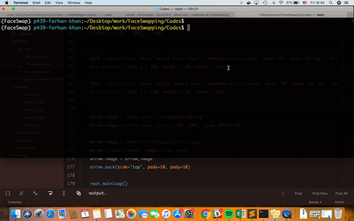

# Tkinter based App for face swapping.

The app is built using Tkinter and uses opencv and dlib for finding the landmark points from the face images and swipe them from 2nd image to 1st image.

The core logic for swapping the landmarks points is taken from [this repository](https://github.com/matthewearl/faceswap). [See this blog](http://matthewearl.github.io/2015/07/28/switching-eds-with-python/) for more details.

# Usage
```sh
python Codes/face_swap_app.py
```


 
